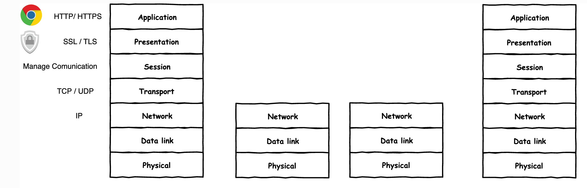

## communications osi/iso

## route Configuration

* routing
    * add default route
    * add route via gateway
    * add route via interface
    * delete route
    * change route
    * get route for address
     
### ip 
| subcommand    |  command   | description  |
| ------------- |:-------------| :---------------| 
|   ``route``    |                               | |
|               |   ``ip route add``             | |

### Applications

* Separate network for network devices.
* Separating guest WIFI devices into a separate network
* Ensuring communication between separate local networks using VPN

### Task

1.
   * Prepare the network configuration according to the diagram above, 
   * Test the connection between all network elements
   * Why the connection may not work
2. Prepare the configuration so that it will load correctly after reboot
   * See ``fixing a static configuration in exercise 2``.
   * note the differences between the system's distributions
3. Install, run and test the ``chat`` application
   * application available on github ``https://github.com/jkanclerz/client-server-chat`` or preinstalled on a machine available in the course resources

### Homework

1. Prepare the configuration from Task 1 using a different operating system on a computer that acts as a router.
  * debian / centos / other
  * ensure proper communication between PC3 -> PC1
  
2. Add another network to the computer acting as a router
   * Verify proper communication between other areas of the network.
   * Verify the operation of the chat program between different network segments.

