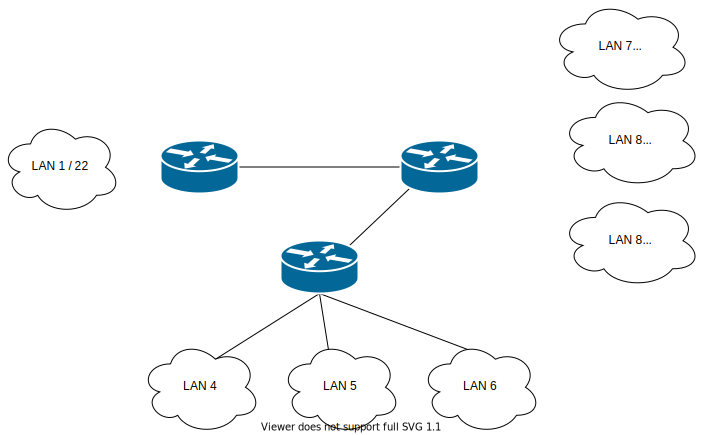

# Task 2

The network design has met expectations, the organisation wants to split the legacy networks into several subnets after taking into account the new requirements.

Design and document a prototype solution using ``CISCO Packet Tracer``, ``VirtualBox`` or similar software. 

## Scheme

## Characteristics
  * LAN 1 remains unchanged
  * LAN 2 is split into 3 equal subnets
  * LAN 3 is split into 3 subnets with
    * subnet 1 to support up to 500 hosts
    * subnet 2 to support up to 100 hosts
    * subnet 3 to support up to 80 hosts
  * The link between Router (LAN 1) and Router (LAN 2) has also been removed.
  * Include the changes in the routing table

## Contents

 * Addresses for each IP network.
 * Link addresses between routers.
 * The routing tables on each router
 