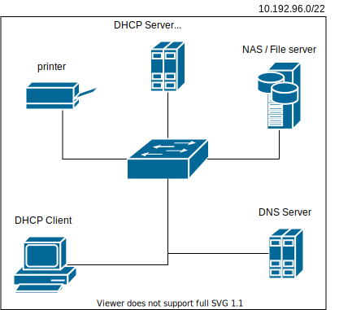

## DNS - Domain name server

  * http://www.thekelleys.org.uk/dnsmasq/doc.html
  * https://www.isc.org/downloads/bind/
  * https://www.iana.org/domains/root/servers
  * https://root-servers.org
  * https://pasja-informatyki.pl/sieci-komputerowe/dns-rodzaje-zapytan/
  
  

## Zadanie

1.
   *  Prepare the network configuration according to the diagram above
   * Verify the correct internet connection for ``PC0``
      * address
   * Configure the ``DHCP`` server for the ``PC0`` so that all newly connected devices will have the correct ``ip`` configuration 
  

      | Key    |  value   |
      | ------------- |:-------------|  
      |   ``ip``   |   ``10.192.192.0 - 10.192.200.0``  |
      |   ``mask`` |   ``255.255.252.0``                |
      |   ``gateway`` |     ``{wlasciwe ip}``              |
      |   ``dns``  |  ``{wlasciwe ip}``                 |
     
   * Run the `dnsmasq` service for the `PC0`.
   * Configure the `DHCP` service so that the `PC1` always gets the same IP address
   * Modify the configuration accordingly so that any computer on the network 
   When communicating with a ``chat.mydomain.local`` address, it will be expanded to the address of the ``PC1`` computer
   * Run the `http-chat` service on the `PC1` computer.
   * Test the operation of the `http-chat` with the `PC2` or another newly connected computer
 
   

##  Useful commands

| command    |  example   | description  |
| ------------- |:-------------| :---------------| 
|   ``nslookup``    | ``nslookup uek.krakow.pl`` | dns server query |
|   ``nslookup``    | ``nslookup uek.krakow.pl 8.8.8.8`` | dns server query to the particular node |
|   ``dig``         | ``dig uek.krakow.pl``      | dns server query |
|                   |                            | clear local dns cache |   

## extra

Adblock via DNS !!
   * dnsmasq
   * list of trackers and advertisers https://github.com/notracking/hosts-blocklists

